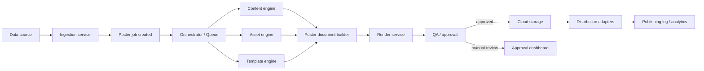

# Poster Automation Architecture

Tai lieu nay mo ta cach nang cap repo `CreatePoster` tu studio render poster thu cong thanh he thong tu dong hoa poster tu dau den cuoi:

- nhan du lieu dau vao
- chon template
- sinh noi dung
- chon anh
- render poster
- luu cloud
- gui duyet hoac dang len kenh phan phoi

Muc tieu la thiet ke theo huong co the build tung phan, khong phai viet lai toan bo he thong trong mot lan.

## 1. Dinh huong tong the

Khong nen gom tat ca logic vao mot app Next.js. Nen chia he thong thanh cac lop:

`Input -> Orchestrator -> Content/Asset/Template Decision -> Render -> QA/Approval -> Storage -> Distribution -> Monitoring`

Trong repo hien tai:

- `src/components/poster-studio.tsx`: studio de xem va chinh payload
- `src/app/api/webhooks/poster/route.ts`: webhook nhan payload va render `image/png`
- `src/lib/poster-schema.ts`: validate payload dau vao
- `src/lib/poster-types.ts`: dinh nghia `PosterDocument`

Co the xem day la `render core` ban dau. He thong full automation se bo sung cac tang con thieu xung quanh no.

## 2. Kien truc muc tieu

### 2.1 Cac module chinh

1. `Ingestion Service`
- Nhan data tu form, Google Sheet, CRM, CSV, API, webhook campaign.
- Chuyen du lieu ve dang `PosterJob`.
- Validate field bat buoc.

2. `Poster Orchestrator`
- Dieu phoi trang thai cua moi job.
- Goi tung buoc theo thu tu.
- Retry neu mot buoc loi.
- Luu lich su job.

3. `Content Engine`
- Sinh headline, subheadline, CTA, section text.
- Co the dung rule + AI.
- Bat buoc kiem soat do dai va tone.

4. `Asset Engine`
- Tim anh theo tag, industry, campaign, product.
- Fallback sang stock source hoac AI image neu cho phep.

5. `Template Engine`
- Chon template phu hop voi loai poster, kenh, size, industry, style.
- Khong de AI chon tu doan. Nen loc template hop le bang rule truoc.

6. `Render Service`
- Nhan `PosterDocument` da hoan chinh.
- Render ra `PNG/JPG/PDF`.
- Co the tan dung webhook va render logic cua repo hien tai.

7. `QA/Approval Service`
- Kiem tra loi layout, text overflow, missing image, missing logo, wrong ratio.
- Tu dong approve neu dat rule.
- Day sang hang doi duyet neu fail hoac can kiem duyet thu cong.

8. `Storage Service`
- Luu file va metadata len cloud.
- Vi du: `S3`, `Cloudinary`, `Cloudflare R2`, `Google Drive`.

9. `Distribution Service`
- Dang len kenh can dung: social, CMS, email, Slack, Zalo, Telegram.
- Moi kenh nen la mot adapter rieng.

10. `Monitoring & Audit`
- Log, metrics, retry, dead-letter queue, alert.
- Theo doi poster nao da tao, da duyet, da dang, dang loi.

### 2.2 So do luong xu ly



## 3. Mo hinh du lieu

Khong nen nhan thang du lieu roi render ngay trong full automation. Nen co 3 lop du lieu:

1. `Input payload`
- Du lieu thuc te tu CRM, form, sheet, campaign.

2. `Poster job`
- Ban ghi dieu phoi he thong.

3. `Poster document`
- Payload da duoc chuan hoa de render.

### 3.1 Input payload de xuat

```json
{
  "source": "crm",
  "campaignId": "cmp_2026_summer_01",
  "posterType": "recruitment",
  "industry": "automation",
  "channelTargets": ["facebook", "instagram"],
  "language": "vi",
  "brandCode": "esutech",
  "companyName": "OKADEN",
  "goal": "Tuyen ky su tu dong hoa",
  "keyOffer": "Dao tao va phat trien dai han",
  "cta": "Ung tuyen ngay",
  "imageHints": ["factory", "engineer", "automation line"],
  "publishAt": "2026-07-09T09:00:00+07:00",
  "sizes": ["1080x1350", "1080x1080"]
}
```

### 3.2 Bang `poster_jobs`

Dung de quan ly vong doi tu dong hoa.

```text
poster_jobs
- id
- source
- source_ref
- campaign_id
- poster_type
- industry
- brand_code
- status
- priority
- requested_publish_at
- approved_at
- published_at
- error_code
- error_message
- created_at
- updated_at
```

`status` de xuat:

- `received`
- `normalized`
- `content_generated`
- `assets_selected`
- `template_selected`
- `rendering`
- `qa_failed`
- `pending_approval`
- `approved`
- `stored`
- `publishing`
- `published`
- `failed`

### 3.3 Bang `poster_job_payloads`

Luu raw va normalized payload de debug.

```text
poster_job_payloads
- id
- poster_job_id
- payload_type        // raw_input | normalized_input | render_payload
- payload_json
- created_at
```

### 3.4 Bang `poster_templates`

```text
poster_templates
- id
- code
- name
- poster_type
- industry
- style
- supported_sizes
- active
- version
- rules_json
- created_at
- updated_at
```

`rules_json` co the chua:

- max headline length
- max bullet count
- required hero image
- allowed channels
- allowed industries

### 3.5 Bang `asset_library`

```text
asset_library
- id
- type                // image | logo | icon | background
- title
- tags
- industry
- brand_code
- source_kind         // uploaded | stock | ai_generated
- cloud_url
- width
- height
- license_info
- active
- created_at
```

### 3.6 Bang `poster_outputs`

```text
poster_outputs
- id
- poster_job_id
- template_id
- size_code
- format              // png | jpg | pdf
- cloud_url
- checksum
- qa_status
- published_channels
- created_at
```

### 3.7 Bang `poster_publish_logs`

```text
poster_publish_logs
- id
- poster_output_id
- channel
- action              // queued | published | failed
- external_ref
- response_json
- created_at
```

## 4. Mo hinh workflow

### 4.1 Pipeline chinh

1. `Receive`
- Nhan input tu data source.
- Tao `poster_job`.

2. `Normalize`
- Map input sang schema noi bo.
- Chuan hoa field text, size, channel, brand.

3. `Generate content`
- Sinh headline, subheadline, intro, CTA.
- Neu co input text day du thi co the bo qua AI.

4. `Select assets`
- Tim hero image, background, logo.
- Kiem tra kich thuoc va ty le.

5. `Select template`
- Loc danh sach template hop le.
- Chon template tot nhat.

6. `Build render payload`
- Chuyen du lieu sang `PosterDocument` dung schema hien tai cua repo.

7. `Render`
- Goi render service tao file output.

8. `Run QA`
- Kiem tra anh da render.
- Neu fail, thu template khac hoac day sang review.

9. `Store`
- Upload file output.
- Ghi metadata.

10. `Approve / publish`
- Auto publish neu du dieu kien.
- Hoac cho manual approval.

11. `Notify`
- Bao ket qua qua Slack, email, dashboard.

### 4.2 Retry va fallback

Moi buoc nen co retry rieng:

- `content generation`: retry toi da 2 lan
- `asset fetch`: retry toi da 3 lan
- `render`: retry toi da 2 lan
- `publish`: retry theo adapter

Fallback de xuat:

- Khong co anh phu hop -> dung default asset theo industry
- Headline qua dai -> goi ham rut gon truoc khi render
- Template fail QA -> thu template tiep theo trong danh sach
- Publish fail -> luu output, gui canh bao, khong mat poster

## 5. Quy tac chon template

Khong nen de mot prompt AI quyet dinh 100%. Nen chia 2 lop:

### 5.1 Rule filter

Loc template theo:

- `poster_type`
- `industry`
- `channel`
- `size`
- `language`
- `brand_code`

### 5.2 Ranking

Cham diem trong danh sach da hop le:

- do dai headline
- so luong section
- co anh hero hay khong
- muc do hop tone voi industry

Cong thuc don gian:

```text
score = fit_size + fit_content_density + fit_industry + fit_channel
```

Neu can AI, chi dung AI de `rank` trong 3-5 template da loc, khong dung de mo rong khong kiem soat.

## 6. Quy tac sinh noi dung

Nen tach `AI generation` va `brand rules`.

### 6.1 Brand rules

- max `headline`: 24-36 ky tu tuy template
- max `subheadline`: 60-90 ky tu
- max `CTA`: 12-18 ky tu
- cam tu khoa nhay cam
- bat buoc dung xung ho va tone dung brand

### 6.2 AI generation contract

AI nhan:

- campaign objective
- audience
- brand tone
- industry
- text limits

AI tra ve:

- 3 phuong an headline
- 2 phuong an subheadline
- 2 CTA

Sau do rule engine chon phuong an hop le nhat.

## 7. Quy tac chon anh

Nen uu tien tai san co san de giu brand consistency.

Thu tu:

1. `Brand asset library`
2. `Approved stock source`
3. `AI-generated image`

Dieu kien bat buoc:

- dung ti le anh cua template
- khong mo mat/chu the qua muc
- do phan giai dat muc toi thieu
- co metadata nguon anh

## 8. Render layer cho repo hien tai

Repo nay da co `PosterDocument` va webhook render anh. Nen giu vai tro sau:

### 8.1 Vai tro hien tai

- `poster-schema.ts`: schema render cuoi
- `webhooks/poster`: diem vao render file anh
- `poster-studio`: man hinh debug payload

### 8.2 Cach nang cap

Khong doi schema render qua som. Nen them lop trung gian:

- `NormalizedPosterInput`
- `PosterGenerationDecision`
- `PosterDocument`

Co nghia la:

1. He thong full automation xu ly o tang `job + decision`
2. Den buoc cuoi moi map ve `PosterDocument`
3. Render service tiep tuc dung schema hien tai

Loi ich:

- khong pha studio dang co
- de test tung lop
- de them workflow sau nay

## 9. API de xuat

### 9.1 Nhan job moi

`POST /api/poster-jobs`

Body:

```json
{
  "source": "crm",
  "campaignId": "cmp_001",
  "posterType": "recruitment",
  "industry": "automation",
  "channelTargets": ["facebook"],
  "brandCode": "esutech"
}
```

Response:

```json
{
  "ok": true,
  "jobId": "job_001",
  "status": "received"
}
```

### 9.2 Xem job

`GET /api/poster-jobs/:id`

Tra ve:

- status hien tai
- log tung buoc
- output files
- publish logs

### 9.3 Duyet thu cong

`POST /api/poster-jobs/:id/approve`

### 9.4 Publish lai

`POST /api/poster-jobs/:id/republish`

### 9.5 Render thu cong nhu hien tai

Giu lai:

`POST /api/webhooks/poster`

Day la low-level render endpoint rat huu ich cho test va automation noi bo.

## 10. Queue jobs de xuat

Neu muon lam nhanh va phu hop Node.js:

- `Redis`
- `BullMQ`

Hang doi de xuat:

- `poster-intake`
- `poster-content`
- `poster-assets`
- `poster-template`
- `poster-render`
- `poster-qa`
- `poster-publish`
- `poster-notify`

Khong nhat thiet phai tach worker ngay tu dau. Phase 1 co the 1 worker xu ly nhieu queue, phase sau moi tach.

## 11. Dashboard quan tri

Nen co 5 man quan trong:

1. `Job list`
- loc theo status, campaign, source, industry, publish date

2. `Job detail`
- xem raw input, normalized input, render payload, output file, publish logs

3. `Approval queue`
- duyet nhanh poster fail auto QA hoac can xac nhan tay

4. `Template manager`
- them/sua/tat template
- xem template dang ap dung cho rule nao

5. `Asset manager`
- tai anh/logo
- gan tag, brand, industry

## 12. Bao mat va quyen han

Can phan quyen ro:

- `operator`: tao job, xem job
- `editor`: sua content, retry job
- `approver`: duyet poster
- `publisher`: dang len kenh
- `admin`: quan ly template, asset, integration

Can bo sung:

- API key cho webhook intake
- signed URL neu tai file output
- audit log cho approve va publish

## 13. Monitoring

Can it nhat cac chi so sau:

- tong job moi ngay
- ty le render thanh cong
- ty le QA fail
- thoi gian trung binh tu intake den output
- ty le publish thanh cong theo tung kenh
- so lan fallback sang default asset

Canh bao khi:

- queue bi un
- render fail hang loat
- publish adapter fail lien tuc
- cloud upload fail

## 14. Stack de xuat

Neu tiep tuc tren stack hien tai:

- `Frontend`: `Next.js`
- `API`: route handlers hoac tach `NestJS` neu he thong lon
- `DB`: `PostgreSQL`
- `Queue`: `BullMQ + Redis`
- `Storage`: `S3` hoac `Cloudflare R2`
- `Render`: giu render logic hien tai, mo rong neu can nhieu template/size
- `AI text`: LLM API
- `Observability`: `Sentry` + app logs + dashboard metrics

Neu muon don gian giai doan dau, co the de:

- `Next.js` lam UI + API
- 1 worker Node.js rieng cho queue
- 1 DB Postgres
- 1 bucket cloud

## 15. Lo trinh trien khai thuc te

### Phase 1: Foundation

Muc tieu:

- tao `poster_jobs`
- luu payload
- tao queue render
- luu output cloud

Lam truoc:

- bang DB co ban
- API tao job
- worker render
- output storage
- trang job list toi thieu

### Phase 2: Decision automation

Muc tieu:

- tu dong chon template
- tu dong chon asset
- tu dong sinh text trong khung rule

Lam them:

- `poster_templates`
- `asset_library`
- rule engine
- content engine

### Phase 3: QA + approval

Muc tieu:

- auto QA
- approval dashboard
- retry/fallback

### Phase 4: Distribution

Muc tieu:

- publish adapters
- scheduling
- notification
- analytics

## 16. Thu tu build de xuat cho repo nay

Neu build ngay tren repo hien tai, nen di theo thu tu sau:

1. Tao `docs` va chot model du lieu
2. Them `poster_jobs` + `poster_outputs`
3. Tao `POST /api/poster-jobs`
4. Tao worker render tai su dung schema `PosterDocument`
5. Upload output len cloud
6. Tao dashboard xem danh sach job
7. Moi them rule chon template va sinh text

Ly do:

- ban da co render core
- can xay vong doi job truoc
- neu lam AI truoc se kho debug va kho van hanh

## 17. Quyet dinh ky thuat quan trong

Nen:

- giu `PosterDocument` la render contract cuoi
- tao `PosterJob` lam entity trung tam
- tach worker render khoi request HTTP
- dung queue thay vi render dong bo trong request lon
- uu tien rule-based decision truoc, AI sau
- luu day du raw input, normalized input, render payload de debug

Khong nen:

- render va publish truc tiep trong 1 request
- de AI quyet dinh khong co rule guardrail
- tron template metadata voi output metadata
- bo qua approval/audit neu day la workflow doanh nghiep

## 18. Ban rut gon de de trao doi voi team

Neu can noi ngan gon voi team, co the dung cau nay:

`He thong poster automation nen duoc thiet ke theo kieu job pipeline: nhan input -> chuan hoa du lieu -> sinh content/anh/template -> map sang PosterDocument -> render -> QA -> luu cloud -> publish, trong do PosterJob la trung tam, queue dung de dieu phoi, va render contract cuoi tiep tuc tai su dung schema hien tai cua repo.`

